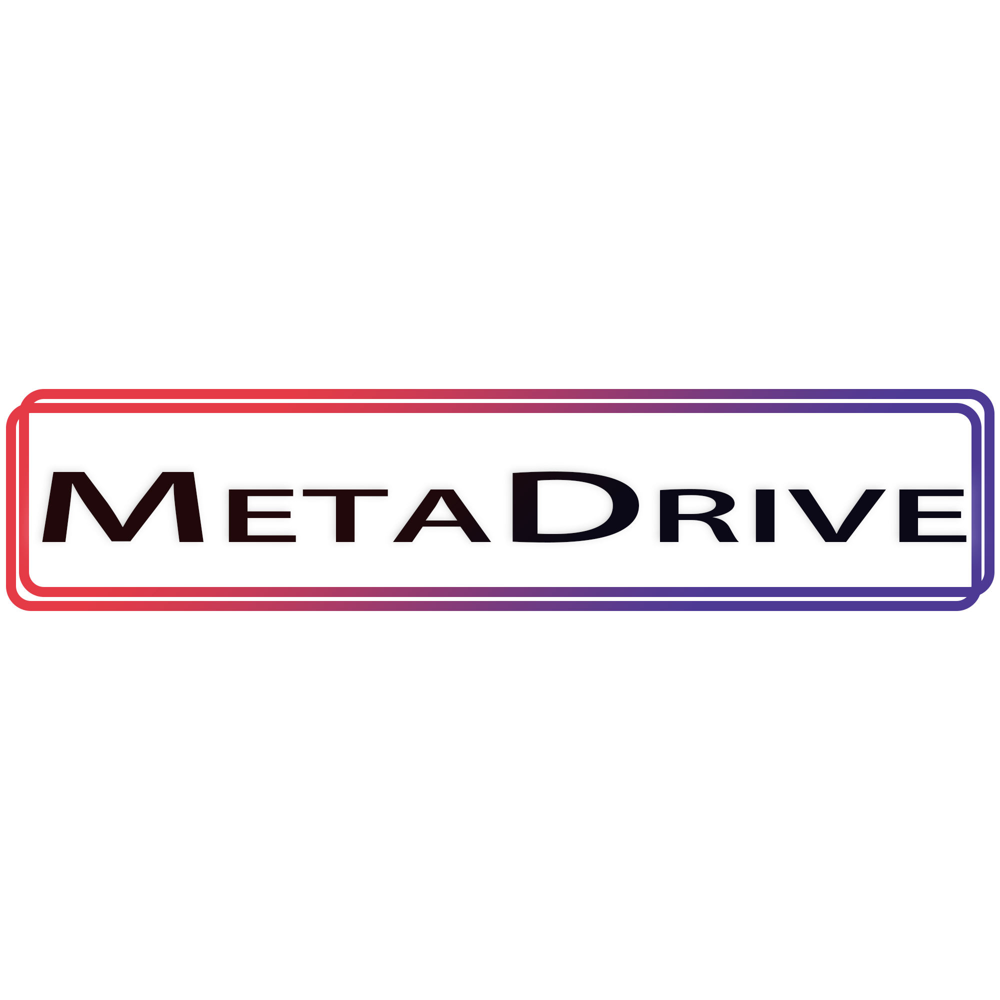
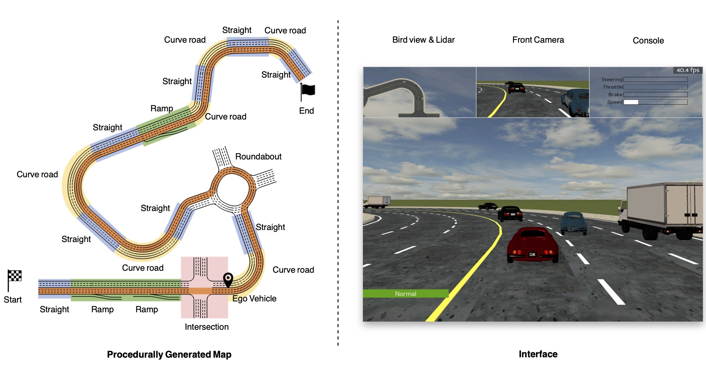

# MetaDrive: an open-ended driving simulator with infinite scenes

[](http://github.com/decisionforce/metadrive/actions)
[](https://codecov.io/gh/decisionforce/metadrive)
[](https://metadrive-simulator.readthedocs.io)
[](https://github.com/decisionforce/metadrive/blob/main/LICENSE.txt)
[](https://github.com/decisionforce/metadrive/stargazers)


**Though the development of MetaDrive is alrady settled for current stage, we are still working on managing the documentation and other stuff. We expect to finish all cleanup by 1st, September.**


Welcome to MetaDrive! MetaDrive is an driving simulator with many key features, including:

- 🎏 **Lightweight**: Extremely easy to download, install and run in almost all platforms.
- 📷 **Realistic**: Accurate physics simulation and multiple sensory inputs.
- 🚀 **Efficient**: Up to 500 simulation step per second and easy to parallel.
- 🗺 **Open-ended**: Support generating infinite scenes and configuring various traffic, vehicle, and environmental settings.





## 🛠 Quick Start
Please install MetaDrive via:

```bash
git clone https://github.com/decisionforce/metadrive.git
cd metadrive
pip install numpy cython
pip install -e .
```

You can verify the installation and efficiency of MetaDrive via running:

```bash
python -m metadrive.examples.profile_metadrive
```

The above script is supposed to be runnable in all places.
Note that please do not run the above command in the folder that has a sub-folder called `./metadrive`.

## 🚕 Examples

Please run the following line to drive the car in the environment manually with keyboard, and
Press T to trigger the auto-drive mode

```bash
python -m metadrive.examples.enjoy_manual
```

To show the main feature, procedural generation, we provide a script to show BIG:

```bash
python -m metadrive.examples.render_big
```

*Note that the above three scripts can not be run in headless machine.* 
Please refer to the installation guideline in documentation for more information.

Running the following line allows you to draw the generated maps:

```bash
python -m metadrive.examples.draw_maps
```

To build the environment in python script, you can simply run:

```python
import metadrive  # Import this package to register the environment!
import gym

env = gym.make("MetaDrive-v0", config=dict(use_render=True))
# env = metadrive.MetaDriveEnv(config=dict(environment_num=100))  # Or build environment from class
env.reset()
for i in range(1000):
    obs, reward, done, info = env.step(env.action_space.sample())  # Use random policy
    env.render()
    if done:
        env.reset()
env.close()
```


## 📦 Predefined environment sets

We also define several Gym environment names, so user can start training in the minimalist manner:

```python
import gym
import metadrive  # Register the environment

env = gym.make("MetaDrive-v0")
```

The following table presents some predefined environment names. 

|&nbsp;  Gym Environment Name   | Random Seed Range | Number of Maps | Comments                                          |
| ----------------------- | ----------------- | -------------- | ------------------------------------------------------- |
| `MetaDrive-test-v0`       | [0, 200)          | 200            | Test set, not change for all experiments.               |
| `MetaDrive-validation-v0` &nbsp; &nbsp; &nbsp; &nbsp; &nbsp; &nbsp; &nbsp; &nbsp; &nbsp;|[200, 1000)|800| Validation set.|
| `MetaDrive-v0`            | [1000, 1100)      | 100            | Default training setting, for quick start.              |
| `MetaDrive-10envs-v0`     | [1000, 1100)      | 10             | Training environment with 10 maps.                      |
| `MetaDrive-1000envs-v0`   | [1000, 1100)      | 1000           | Training environment with 1000 maps.                    |
| `MetaDrive-training0-v0`  | [3000, 4000)      | 1000           | First set of 1000 environments.                         |
| `MetaDrive-training1-v0`  | [5000, 6000)      | 1000           | Second set of 1000 environments.                        |
| `MetaDrive-training2-v0`  | [7000, 8000)      | 1000           | Thirds set of 1000 environments.                        |
| ...                     |                   |                | *More map set can be added in response to the requests* |


## 🏫 Documentations

Find more detail in: [MetaDrive](https://metadrive-simulator.readthedocs.io)


## 📎 Citation

Working in Progress!


[](https://www.codacy.com/gh/decisionforce/metadrive/dashboard?utm_source=github.com&amp;utm_medium=referral&amp;utm_content=decisionforce/metadrive&amp;utm_campaign=Badge_Grade)
[](https://github.com/decisionforce/metadrive/graphs/contributors)
[](https://github.com/decisionforce/metadrive/network)
[](https://github.com/decisionforce/metadrive/issues)
