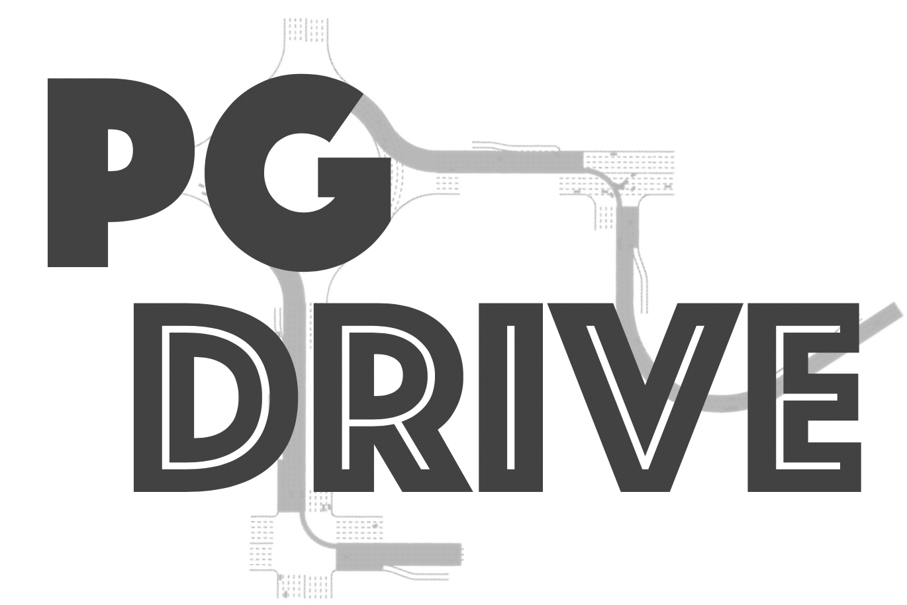

# PGDrive: an open-ended driving simulator with infinite scenes

[](https://pgdrive.readthedocs.io)
[](http://github.com/decisionforce/pgdrive/actions)

**[  📺 [Website](https://decisionforce.github.io/pgdrive/) | 🏗 [Github Repo](https://github.com/decisionforce/pgdrive) | 📜 [Documentation](https://pgdrive.readthedocs.io/) | 🎓 [Paper](https://arxiv.org/abs/2012.13681) ]**

Welcome to PGDrive! PGDrive is an driving simulator with many key features, including:

- 🎏 **Lightweight**: Extremely easy to download, install and run in almost all platforms.
- 📷 **Realistic**: Accurate physics simulation and multiple sensory inputs.
- 🚀 **Efficient**: Up to 500 simulation step per second and easy to parallel.
- 🗺 **Open-ended**: Support generating infinite scenes and configuring various traffic, vehicle, and environmental settings.


## 🛠 Quick Start
Please install PGDrive via:

```bash
pip install pgdrive
```

If you wish to contribute to this project or make some modification, you can clone the latest version of PGDrive locally and install via:

```bash
git clone https://github.com/decisionforce/pgdrive.git
cd pgdrive
pip install -e .
```

You can verify the installation and efficiency of PGDrive via running:

```bash
python -m pgdrive.examples.profile_pgdrive
```

The above script is supposed to be runnable in all places.
Note that please do not run the above command in the folder that has a sub-folder called `./pgdrive`.

## 🚕 Examples

Please run the following line to drive the car in the environment manually with keyboard!

```bash
python -m pgdrive.examples.enjoy_manual
```

You can also enjoy a journey carrying out by our professional driver pretrained from reinforcement learning! 

```bash
python -m pgdrive.examples.enjoy_expert
```

To show the main feature, procedural generation, we provide a script to show BIG:

```bash
python -m pgdrive.examples.render_big
```

*Note that the above three scripts can not be run in headless machine.* 
Please refer to the installation guideline in documentation for more information.

Running the following line allows you to draw the generated maps:

```bash
python -m pgdrive.examples.draw_maps
```

To build the environment in python script, you can simply run:

```python
import pgdrive  # Import this package to register the environment!
import gym

env = gym.make("PGDrive-v0", config=dict(use_render=True))
# env = pgdrive.PGDriveEnv(config=dict(environment_num=100))  # Or build environment from class
env.reset()
for i in range(1000):
    obs, reward, done, info = env.step(env.action_space.sample())  # Use random policy
    env.render()
    if done:
        env.reset()
env.close()
```

We also prepare a Colab which demonstrates some basic usage of PGDrive as follows:
[](https://colab.research.google.com/github/decisionforce/PGDrive/blob/main/pgdrive/examples/Basic%20PGDrive%20Usages.ipynb)

## 📦 Predefined environment sets

We also define several Gym environment names, so user can start training in the minimalist manner:

```python
import gym
import pgdrive  # Register the environment
env = gym.make("PGDrive-v0")
```

The following table presents some predefined environment names. 

|&nbsp;  Gym Environment Name   | Random Seed Range | Number of Maps | Comments                                          |
| ----------------------- | ----------------- | -------------- | ------------------------------------------------------- |
| `PGDrive-test-v0`       | [0, 200)          | 200            | Test set, not change for all experiments.               |
| `PGDrive-validation-v0` &nbsp; &nbsp; &nbsp; &nbsp; &nbsp; &nbsp; &nbsp; &nbsp; &nbsp;|[200, 1000)|800| Validation set.|
| `PGDrive-v0`            | [1000, 1100)      | 100            | Default training setting, for quick start.              |
| `PGDrive-10envs-v0`     | [1000, 1100)      | 10             | Training environment with 10 maps.                      |
| `PGDrive-1000envs-v0`   | [1000, 1100)      | 1000           | Training environment with 1000 maps.                    |
| `PGDrive-training0-v0`  | [3000, 4000)      | 1000           | First set of 1000 environments.                         |
| `PGDrive-training1-v0`  | [5000, 6000)      | 1000           | Second set of 1000 environments.                        |
| `PGDrive-training2-v0`  | [7000, 8000)      | 1000           | Thirds set of 1000 environments.                        |
| ...                     |                   |                | *More map set can be added in response to the requests* |

## 🏫 Documentations

More information about PGDrive can be found in [PGDrive Documentation](https://pgdrive.readthedocs.io).


