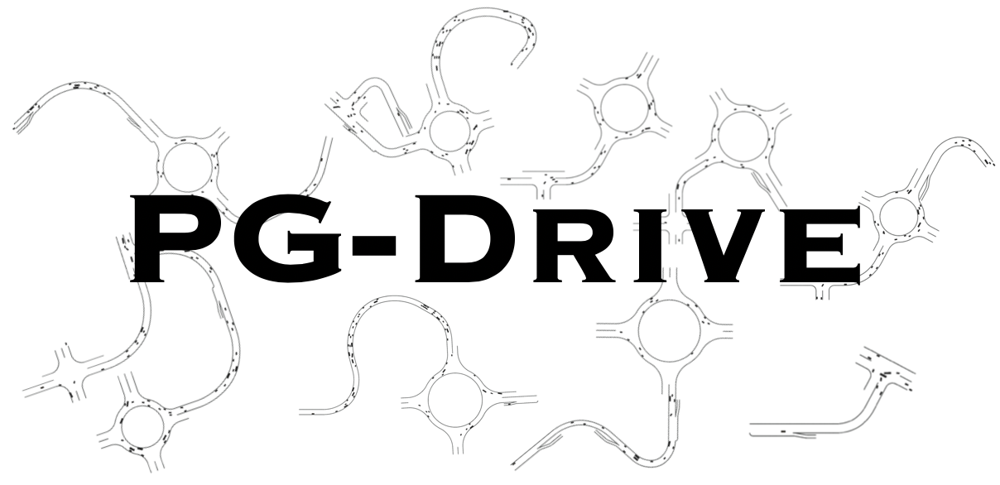

# PG-Drive: A highly flexible open-ended driving simulator

Please install PG-Drive via:

```bash
pip install git+https://github.com/decisionforce/pg-drive.git
```

or you can install via:

```bash
git clone https://github.com/decisionforce/pg-drive.git
cd pg-drive
pip install -e .
```

## Quick Start

Please run `python -m pg_drive.examples.enjoy` to play with the environment with keyboard!

To build the environment, you can simply run:

```python
import pg_drive  # Import this package to register the environment!
import gym

env = gym.make("GeneralizationRacing-v0", config=dict(use_render=True))
env.reset()
for i in range(1000):
    obs, reward, done, info = env.step(env.action_space.sample())
    env.render()
    if done:
        env.reset()
env.close()
```

You can also enjoy a journey carrying out by our professional driver! The provided expert can drive in 10000 maps 
with almost 90% likelihood to achieve the destination. 

Note that this script requires your system to have the capacity of rendering. Please refer to the installation guideline for more information.
```bash
python -m pg_drive.examples.enjoy_journey
```


## Predefined environment sets

We also define several Gym environment names, so user can start training in the minimalist manner:

```python
import gym
import pg_drive  # Register the environment
env = gym.make("PGDrive-v0")
```

The following table presents some predefined environment names. Please feel free to open an issue if you want to request some new environments.

| Gym Environment Name   | Random Seed Range | Number of Maps | Comments                                                |
| ----------------------- | ----------------- | -------------- | ------------------------------------------------------- |
| `PGDrive-test-v0`       | [0, 200)          | 200            | Test set, not change for all experiments.               |
| `PGDrive-validation-v0` | [200, 1000)       | 800            | Validation set.                                         |
| `PGDrive-v0`            | [1000, 1100)      | 100            | Default training setting, for quick start.              |
| `PGDrive-10envs-v0`            | [1000, 1100)      | 10            | Training environment with 10 maps.              |
| `PGDrive-1000envs-v0`            | [1000, 1100)      | 1000            | Training environment with 1000 maps.              |
| `PGDrive-training0-v0`  | [3000, 4000)      | 1000           | First set of 1000 environments.                         |
| `PGDrive-training1-v0`  | [5000, 6000)      | 1000           | Second set of 1000 environments.                        |
| `PGDrive-training2-v0`  | [7000, 8000)      | 1000           | Thirds set of 1000 environments.                        |
| ...                          |                   |                | *More map set can be added in response to the requests* |
