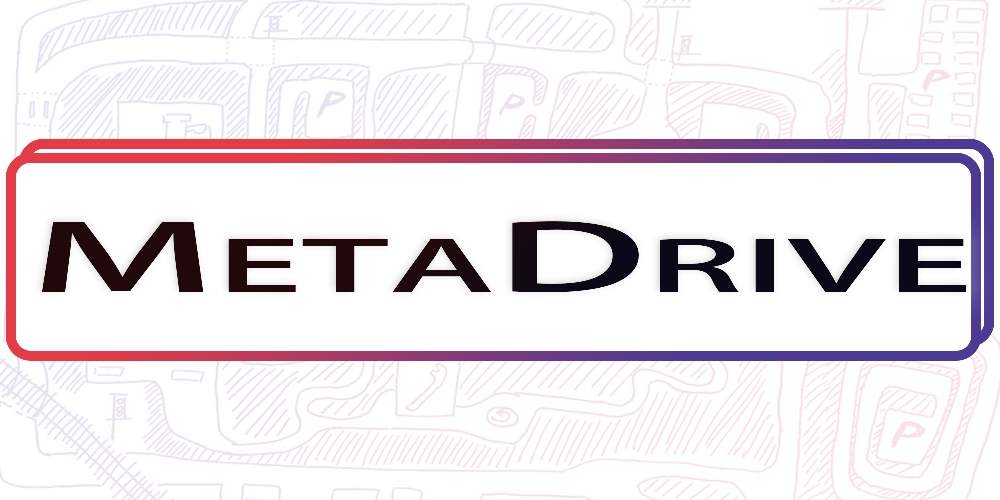

|
|

########################
MetaDrive Documentation
########################

Welcome to the MetaDrive documentation!
MetaDrive is an efficient and compositional driving simulator with the following key features:

* Compositional: It supports generating infinite scenes with various road maps and traffic settings for the research of generalizable RL.
* Lightweight: It is easy to install and run. It can run up to 300 FPS on a standard PC.
* Realistic: Accurate physics simulation and multiple sensory input including Lidar, RGB images, top-down semantic map and first-person view images.

This documentation brings you the information on installation, usages and more of MetaDrive!

You can also visit the `GitHub repo <https://github.com/metadriverse/metadrive>`_ of MetaDrive.
Please feel free to contact us if you have any suggestions or ideas!

.. toctree::
   :maxdepth: 2
   :hidden:
   :caption: Quick Start

   install.rst
   get_start.rst

.. toctree::
   :hidden:
   :maxdepth: 2
   :caption: RL Training with MetaDrive

   rl_environments.rst
   observation.rst
   reward_cost_and_termination_function.rst
   action_and_dynamics.rst
   config_system.rst
   read_data_from_dataset.rst
   training_with_rllib.rst

.. toctree::
   :hidden:
   :maxdepth: 2
   :caption: Concept and Customization

   concept.rst
   development.rst

.. toctree::
   :hidden:
   :maxdepth: 2
   :caption: Issues

   known_issues.rst

.. raw:: html

    <table width="100%" style="margin: 0pt 0pt; text-align: center;">
        <tr>
            <td>
                <video style="display:block; width:100%; height:auto; "
                       autoplay="autoplay" muted loop="loop" controls playsinline>
                    <source src="https://raw.githubusercontent.com/decisionforce/archive/master/MetaDrive/metadrive_teaser.mp4"
                            type="video/mp4"/>
                </video>
            </td>
        </tr>
    </table>
      

Relevant Projects
#################

.. raw:: html

    <b>
        Learning to Simulate Self-driven Particles System with Coordinated Policy Optimization
    </b>  
    Zhenghao Peng, Quanyi Li, Chunxiao Liu, Bolei Zhou
     
    <i>NeurIPS 2021</i> 
    [<a href="https://arxiv.org/pdf/2110.13827.pdf" target="_blank">Paper</a>]
    [<a href="https://github.com/decisionforce/CoPO" target="_blank">Code</a>]
    [<a href="https://decisionforce.github.io/CoPO" target="_blank">Webpage</a>]
    [<a href="https://decisionforce.github.io/CoPO/copo_poster.pdf" target="_blank">Poster</a>]
    [<a href="https://youtu.be/sOw43l8lwxE" target="_blank">Talk</a>]

      
    <b>Safe Driving via Expert Guided Policy Optimization</b>  
    Zhenghao Peng*, Quanyi Li*, Chunxiao Liu, Bolei Zhou
     
    <i>Conference on Robot Learning (CoRL) 2021</i> 
    [<a href="https://arxiv.org/pdf/2110.06831.pdf" target="_blank">Paper</a>]
    [<a href="https://github.com/decisionforce/EGPO" target="_blank">Code</a>]
    [<a href="https://decisionforce.github.io/EGPO/" target="_blank">Webpage</a>]
    [<a href="https://decisionforce.github.io/EGPO/images/egpo_poster.png" target="_blank">Poster</a>]

      
    <b>
        Efficient Learning of Safe Driving Policy via Human-AI Copilot Optimization
    </b>  
    Quanyi Li*, Zhenghao Peng*, Bolei Zhou
     
    <i>ICLR 2022</i> 
    [<a href="https://arxiv.org/pdf/2202.10341.pdf" target="_blank">Paper</a>]
    [<a href="https://github.com/decisionforce/HACO" target="_blank">Code</a>]
    [<a href="https://decisionforce.github.io/HACO" target="_blank">Webpage</a>]

      

Citation
########

You can read `our white paper <https://arxiv.org/pdf/2109.12674.pdf>`_ describing the details of MetaDrive! If you use MetaDrive in your own work, please cite:

.. code-block:: latex

    @article{li2021metadrive,
      title={MetaDrive: Composing Diverse Driving Scenarios for Generalizable Reinforcement Learning},
      author={Li, Quanyi and Peng, Zhenghao and Xue, Zhenghai and Zhang, Qihang and Zhou, Bolei},
      journal={arXiv preprint arXiv:2109.12674},
      year={2021}
    }

