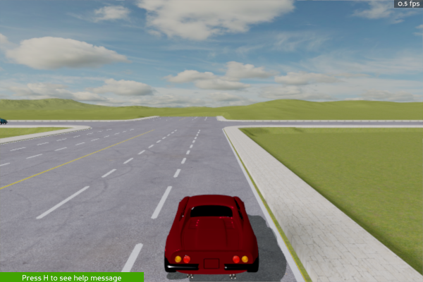

.. _install:

######################
Installing MetaDrive
######################


Install MetaDrive
############################################

The installation of MetaDrive on different platforms is straightforward and easy!
We recommend to use the command following to install::

    git clone https://github.com/metadriverse/metadrive.git
    cd metadrive
    pip install -e .

.. note:: Using ``git clone https://github.com/metadriverse/metadrive.git --single-branch``
  will only pull the main branch and bypass other branches, saving disk space.

.. note:: We don't recommend installing MetaDrive with ``pip install metadrive-simulator`` because it will download the source code from PyPI, which may not be the latest version.


Pull assets
############################################
After having the source code installed, some assets like 3D models are still required to run MetaDrive.
Generally, they will be pulled automatically when you run any MetaDrive program for the first time.
But you can still pull the asset manually by::

 python -m metadrive.pull_asset

.. note:: All ``python -m`` scripts are supposed to be runnable in all places **except** in the working direction that has a sub-folder called :code:`./metadrive`.

Sometimes the assets may be broken or out of date. In this case run the following code to force update the local assets::

 python -m metadrive.pull_asset --update


Verify installation
#############################
To check whether MetaDrive is successfully installed, please run the following code::

    python -m metadrive.examples.profile_metadrive

This script can also verify the efficiency of MetaDrive through the printed messages.
The default observation contains information on ego vehicle's states, Lidar-like cloud points showing neighboring vehicles, and information about navigation and tasks. Besides, you can also try the Pygame-based Top-down rendering (See `TopDownObservation <obs.html#topdownobservation>`_), which is also runnable in most headless machine without any special treatment.
If the above observation is not enough for your RL algorithms and you wish to use the Panda3D camera to provide realistic RGB images as the observation, please continue reading this section.


.. _install_headless:

Install MetaDrive with headless rendering
############################################

The latest MetaDrive is already built to support headless-rendering. But for a double check, run following command::

    python -m metadrive.examples.verify_headless_installation

The script will generate two **same** images to `/path/to/metadrive repo/metadrive/examples`, one from agent observation, the other from panda3d internal rendering buffer.
Please fetch and check those images from cluster to ensure MetaDrive can draw the scene and capture images correctly.
By default, it only generates images from the main camera. Set ```--camera [rgb/depth]``` to check other cameras.
Also, ```--cuda``` flag can be added to test image_on_cuda pipeline for your headless machine.
If the captured main camera images are completed as following, then the installation on headless machine is successful and please move on to `ImageStateObservation <obs.html#imagestateobservation>`_.



|

.. _install_render_cuda:

Install MetaDrive with advanced offscreen rendering
#####################################################

Generally, the default installation method supports getting rendered image. In this case, images will be returned as numpy array, which is retrieved from GPU and costs latency. We provide an advanced function to allow accessing images on GPU directly,
so that you can read them by **Torch** or **Tensorflow**. With such a treatment, the image-based data sampling can be **10x** faster! See: https://github.com/metadriverse/metadrive/issues/306

Requirements:

* CUDA Runtime >= 12.0
* Windows or Linux

Installation:

#. After cloning the repo, use ``pip install -e .[cuda]`` to install, or ``pip install -e metadrive-simulator[cuda]`` if you are using pip.
#. Install Torch::

    conda install pytorch==1.12.1 torchvision==0.13.1 torchaudio==0.12.1 cudatoolkit=11.6 -c pytorch -c conda-forge

#. Install CuPy: ``pip install cupy-cuda11x``
#. Install Cuda-Python: ``conda install -c nvidia cuda-python``
#. For verifying your installation, cd ``metadrive/examples`` and run::

    python verify_image_observation.py --cuda


After running the script, if no error messages, then congratulations! It works.
You can also use ``python verify_image_observation.py --cuda --render`` to visualize the image observations.
Besides, removing ``--cuda`` flag enables benchmarking the original image collection pipeline as a comparison.
And ``--camera`` argument is for choosing sensors from [``rgb``, ``depth``, ``semantic``, ``main`` (default)].


Known Issues
######################


* Pygame 1.9.6 causes blank visualization window in Mac with M1 chip. Upgrading to pygame==2.0.0 solves.
* If you are using cuda feature on Windows and encounter compiling issue when install  PyOpenGL-accelerate, lower the Python version to i.e. 3.8
* To use cuda feature, you need OpenGL >= 4.3, which has the compute shader support