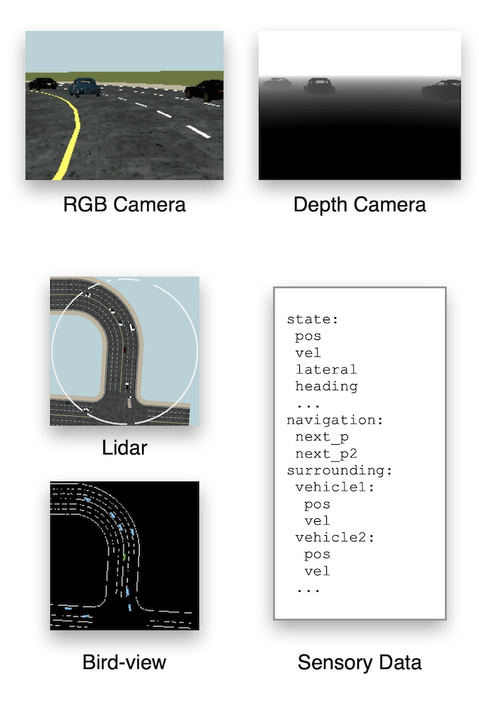

.. _observation:

########################
Observation
########################

MetaDrive provides various kinds of sensory input, as illustrated in the next figure.
For low-level sensors, RGB cameras, depth cameras and Lidar can be placed anywhere in the scene with adjustable
parameters such as view field and the laser number.
Meanwhile, the high-level scene information including the road information and nearby vehicles' information
like velocity and heading can also be provided as the observation.

Note that MetaDrive aims at providing an efficient platform to benchmark RL research,
therefore we improve the simulation efficiency at the cost of photorealistic rendering effect.

In this page, we describe the existing observation forms

.. _use_rendering:

Use Rendering in Training
##########################

Decision making based on low-level visual observation is a challenging topic in RL. MetaDrive supports visuomotor tasks by turning on the rendering during the training.

MetaDrive provides many forms of observation,

Use Panda3D Native Rendering
******************************

.. Note:: Using Panda3D native rendering in headless machines requires special installation process, please refer to :ref:`install_headless`.

This section is working in progress.

.. _use_pygame_rendering:

Use Pygame Top-down Rendering
******************************

This section is working in progress.