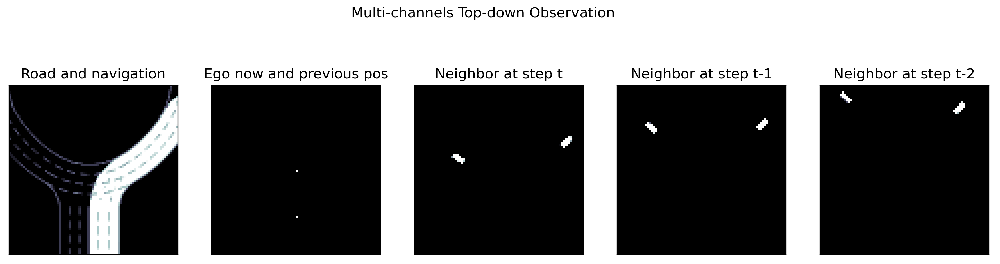
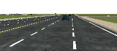

########################
Observation
########################

.. image:: figs/observation_demo.png
   :width: 260
   :align: right

MetaDrive provides various kinds of sensory input, as illustrated in the next figure.
For low-level sensors, RGB cameras, depth cameras and Lidar can be placed anywhere in the scene with adjustable
parameters such as view field and the laser number.
Meanwhile, the high-level scene information including the road information and nearby vehicles' information
like velocity and heading can also be provided as the observation.

Note that MetaDrive aims at providing an efficient platform to benchmark RL research,
therefore we improve the simulation efficiency at the cost of photorealistic rendering effect.

In this page, we describe the optional observation forms in current MetaDrive version and discuss how to
implement new forms of observation subject to your own tasks.

Existing Observation
######################

State Vector
********************

MetaDrive provides a state vector containing necessary information to navigation tasks.
We use this state vector in almost all existing RL experiments such as the Generalization, MARL and Safe RL experiments.

The state vector consist of three parts:

1. **Ego State**: current states such as the steering, heading, velocity and relative distance to boundaries, implemented in `StateObservation Class <https://github.com/decisionforce/metadrive/blob/main/metadrive/envs/observation_type.py>`_.
2. **Navigation**: the navigation information that guides the vehicle toward the destination. Concretely, MetaDrive first computes the route from the spawn point to the destination of the ego vehicle. Then a set of checkpoints are scattered across the whole route with certain intervals. The relative distance and direction to the next checkpoint and the next next checkpoint will be given as the navigation information. This part is implemented in the :code:`_get_info_for_checkpoint` function of `Navigation Class <https://github.com/decisionforce/metadrive/blob/main/metadrive/component/vehicle_module/navigation.py>`_.
3. **Surrounding**: the surrounding information is encoded by a vector containing the Lidar-like cloud points. The data is generated by the `Lidar Class <https://github.com/decisionforce/metadrive/blob/main/metadrive/component/vehicle_module/lidar.py>`_. We typically use 240 lasers (single-agent) and 70 lasers (multi-agent) to scan the neighboring area with radius 50 meters.

The above information is concatenated into a state vector by the `LidarStateObservation Class <https://github.com/decisionforce/metadrive/blob/main/metadrive/envs/observation_type.py>`_ and fed to the RL agents.

.. _use_pygame_rendering:

Pygame Top-down Semantic Maps
********************************

MetaDrive also supports Top-down semantic maps. We provide a handy example to illustrate the utilization of Top-down observation in `top_down_metadrive.py <https://github.com/decisionforce/metadrive/blob/main/metadrive/examples/top_down_metadrive.py>`_.
You can enjoy this demo via::

    python -m metadrive.examples.top_down_metadrive

The following is a minimal script to use Top-down observation.

.. code-block:: python

    from metadrive import TopDownMetaDrive

    env = TopDownMetaDrive()
    o = env.reset()
    for i in range(1, 100000):
        o, r, d, info = env.step([0, 1])
        env.render(mode="top_down")
        if d:
            env.reset()
    env.close()

The :code:`TopDownMetaDrive` is a wrapper class on :code:`MetaDriveEnv` which overrides observation to pygame top-down renderer.
The native observation of this setting is a numpy array with shape :code:`[84, 84, 5]` and all entries fall into [0, 1].
The above figure shows the semantic meaning of each channel.

.. _use_native_rendering:

Use First-view Images in Training
##################################

MetaDrive supports visuomotor tasks by turning on the rendering during the training.

Special config needs to activate camera observation.

1. In env config **offline_render** needs to be **True** to tell MetaDrive retrieving images from camera
2. In vehicle_config (under env config), set **image_source** to **rgb_camera**, **depth_camera** to get different sensory data
3. The image size will be determined by the camera parameters. For example, **rgb_camera=(200, 88)** means that
the image size is in 200 x 88.

note:: This part is working in progress. An example will be provided soon

