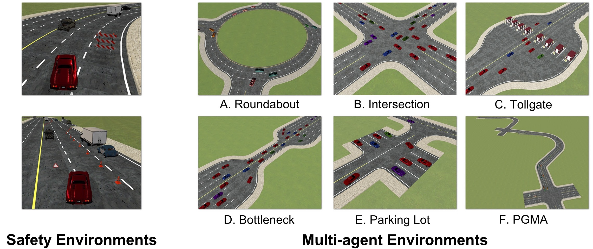

.. _rl_environments:

##########################
Existing RL Environments
##########################

Generalization Environments
###############################

.. raw:: html

     
    <table width="100%" style="margin: 0 0; text-align: center;">
        <tr>
            <td>
            <iframe width="560" height="315" src="https://www.youtube.com/embed/hL0XDfNHYjA" title="MetaDrive Generalization Environments" frameborder="0" allow="accelerometer; autoplay; clipboard-write; encrypted-media; gyroscope; picture-in-picture" allowfullscreen></iframe>
            </td>
        </tr>
    </table>
     

To benchmark the generalizability of a driving policy, we develop an RL environment that can generate an unlimited number of diverse driving scenarios through procedural generation.
The following script creates a basic environment that can be used for such purpose:

.. code-block:: python

    from metadrive import MetaDriveEnv

    env = MetaDriveEnv(dict(
        environment_num=ENVIRONMENT_NUM,
        start_seed=START_SEED,
        random_lane_width=True,
        random_agent_model=True,
        random_lane_num=True
    ))

User can specify the training set with 1000 driving scenarios by setting :code:`ENVIRONMENT_NUM=1000` and :code:`START_SEED=1000`, while creating the test set by setting :code:`ENVIRONMENT_NUM=200` and :code:`START_SEED=0`.
In this case, the scenarios generated by random seeds [1000, 1999] will be used to train the agents and those by [0, 199] will be used to test the trained agent.

.. Note:: Please note that each process should only have one single MetaDrive instance due to the limit of the underlying simulation engine. You can either use the asynchronous version of MetaDrive in `remove_env.py <https://github.com/metadriverse/metadrive/blob/main/metadrive/envs/remoe_env.py>`_, or close the training environment :code:`env_training.close()` before launch the test environment :code:`env_test.reset()`. You can restore the training environment after closing the test environment by simply :code:`env_training.reset()`.

.. hint:: We use `RLLib <https://docs.ray.io/en/latest/rllib.html>`_ to train RL agents. The training and test environments are naturally hosted in training workers (processes) and evaluation workers. Therefore we do not worry about this singleton problem.

------------

Safety Environments
#####################

.. raw:: html

     
    <table width="100%" style="margin: 0 0; text-align: center;">
        <tr>
            <td>
            <iframe width="560" height="315" src="https://www.youtube.com/embed/6YNgwxEvYtg" title="MetaDrive Safety Environments" frameborder="0" allow="accelerometer; autoplay; clipboard-write; encrypted-media; gyroscope; picture-in-picture" allowfullscreen></iframe>
            </td>
        </tr>
    </table>
     

Safety is a major concern for the trial-and-error nature of RL.
As driving itself is a safety-critical application, it is essential to evaluate the constrained optimization methods under the domain of autonomous driving.
We therefore define a new suite of environments to benchmark the **safe exploration** in RL.

As shown in the left panel of the figure above, we randomly display static and movable obstacles in the traffic.
Different from the generalization task, we do not terminate the agent if a collision with those obstacles and traffic vehicles happens.
Instead, we allow agent to continue driving but flag the crash with a cost +1.
Thus as safe exploration task, the learning agent is required to balance the reward and the cost to solve the constrained optimization problem.

The following script can setup such environment. Same as in generalization environment, you can also specify the number of environment and the start seed to initialize two sets of environments to train and test the RL agents and benchmark their safety generalization.

.. code-block:: python

    from metadrive import SafeMetaDriveEnv

    env=SafeMetaDriveEnv(dict(
        environment_num=ENVIRONMENT_NUM,
        start_seed=START_SEED,
    ))

Try the following script to drive in the Safe RL environments.

.. code-block::

    python -m metadrive.examples.drive_in_safe_metadrive_env

Multi-agent Environments
#########################

.. raw:: html

     
    <table width="100%" style="margin: 0 0; text-align: center;">
        <tr>
            <td>
            <iframe width="560" height="315" src="https://www.youtube.com/embed/1-sXZv2ZzXM" title="MetaDrive Multi-agent Environments" frameborder="0" allow="accelerometer; autoplay; clipboard-write; encrypted-media; gyroscope; picture-in-picture" allowfullscreen></iframe>
            </td>
        </tr>
    </table>
     

As shown in the above figure,
we develop a set of environments to evaluate MARL methods for simulating traffic flow.
The descriptions and typical settings of the six traffic environments are as follows:

1. **Roundabout**: A four-way roundabout with two lanes. 40 vehicles spawn during environment reset. This environment includes merge and split junctions.
2. **Intersection**: An unprotected four-way intersection allowing bi-directional traffic as well as U-turns. Negotiation and social behaviors are expected to solve this environment. We initialize 30 vehicles.
3. **Tollgate**: Tollgate includes narrow roads to spawn agents and ample space in the middle with multiple tollgates. The tollgates create static obstacles where the crashing is prohibited. We force agent to stop at the middle of tollgate for 3s. The agent will fail if they exit the tollgate before being allowed to pass. 40 vehicles are initialized. Complex behaviors such as deceleration and queuing are expected. Additional states such as whether vehicle is in tollgate and whether the tollgate is blocked are given.
4. **Bottleneck**: Complementary to Tollgate, Bottleneck contains a narrow bottleneck lane in the middle that forces the vehicles to yield to others. We initialize 20 vehicles.
5. **Parking Lot**: A compact environment with 8 parking slots. Spawn points are scattered in both parking lots or in external roads. 10 vehicles spawn initially and need to navigate toward external roads or enter parking lots. In this environment, we allow agents to back their cars to spare space for others.  Maneuvering and yielding are the key to solve this task.
6. **PGMA** (Procedural Generation Multi-Agent environment): We reuse the procedurally generated scenarios in the generalization environment and replaces the traffic vehicles by controllable target vehicles. These environments contain rich interactions between agents and complex road structures. This multi-agent environment introduces new challenge under the setting of mixed motive RL. Each constituent agent in this traffic system is self-interested and the relationship between agents is constantly changing.

In Multi-agent environment, the termination criterion for each vehicle is identical to that in single-agent environment.
We explicitly add two config to adjust the termination processing in MARL: :code:`crash_done = True` and :code:`out_of_road_done = True`.
They denotes whether to terminate the agent episode if crash / out of road happens.

Besides, in Multi-agent environment, the controllable target vehicles consistently respawn in the scene if old target vehicles are terminated.
To limit the length of *environmental episode*, we also introduce a config :code:`horizon = 1000` in MARL environments.
The environmental episode has a **minimal length** of :code:`horizon` steps and the environment will stop spawning new target vehicles if this horizon is exceeded.
If you wish to disable the respawning mechanism in MARL, set the config :code:`allow_respawn = False`. In this case, the environmental episode will terminate if no active vehicles are in the scene.

You can try to drive a vehicle in Multi-agent environment through this example:

.. code-block::

    # Options for --env: roundabout, intersection, tollgate, bottleneck, parkinglot, pgma
    python -m metadrive.examples.drive_in_multi_agent_env --env pgma

The following script initialize arbitrary Multi-agent environment:

.. code-block:: python

    from metadrive import (
        MultiAgentMetaDrive,
        MultiAgentTollgateEnv,
        MultiAgentBottleneckEnv,
        MultiAgentIntersectionEnv,
        MultiAgentRoundaboutEnv,
        MultiAgentParkingLotEnv
    )

    envs_classes = dict(
        roundabout=MultiAgentRoundaboutEnv,
        intersection=MultiAgentIntersectionEnv,
        tollgate=MultiAgentTollgateEnv,
        bottleneck=MultiAgentBottleneckEnv,
        parkinglot=MultiAgentParkingLotEnv,
        pgma=MultiAgentMetaDrive
    )
    env = envs_classes[CLASS_NAME]()

We are developing new environments for benchmarking novel and challenging RL tasks! Any idea on the design of new tasks are welcomed!
